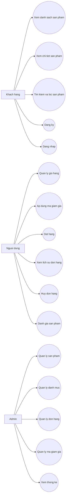

# SnackStore - Website ban do an vat

## Phat bieu bai toan

Trong thuc te, nhu cau mua sam online ngay cang pho bien, dac biet voi cac san pham tieu dung nhanh nhu do an vat, nuoc giai khat, snack. Tuy nhien, nhieu cua hang nho van quan ly san pham va don hang thu cong, gay kho khan khi cap nhat ton kho, theo doi don hang va phuc vu khach hang.

De giai quyet van de do, he thong SnackStore duoc xay dung nhu mot website thuong mai dien tu co ban, cho phep khach hang xem san pham, tim kiem, them vao gio hang, ap dung ma giam gia, dat hang va danh gia san pham. Quan tri vien co the quan ly san pham, don hang, ma giam gia va xem thong ke tong quan.

## Ly do chon de tai

- Phu hop voi xu huong thuong mai dien tu va mua sam truc tuyen tai Viet Nam.
- Bai toan gan voi thuc te, de demo va de mo rong.
- Bao gom du cac module quan trong cua mot website ban hang: user, product, cart, order, search, review, promotion va report.

## Muc tieu he thong

- Xay dung website ban do an vat co giao dien than thien.
- Ho tro nguoi dung dang ky, dang nhap, xem san pham, tim kiem, loc, them gio hang va dat hang.
- Ho tro ma giam gia va danh gia san pham.
- Ho tro admin quan ly san pham, don hang, ma giam gia va thong ke.

## Pham vi he thong

- He thong dung thanh toan COD, chua tich hop cong thanh toan that.
- Ma giam gia duoc xu ly trong he thong, khong lien ket voi ben thu ba.
- Van chuyen duoc tinh phi co ban, chua tich hop don vi giao hang that.
- Du lieu su dung SQLite de phuc vu hoc tap va demo.

## Danh sach chuc nang

| Module | Mo ta | Trang thai |
| --- | --- | --- |
| User | Dang ky, dang nhap, dang xuat, xem thong tin ca nhan, phan quyen admin | Da co |
| Product | CRUD san pham va danh muc qua Django Admin | Da co |
| Cart | Them, xoa, sua so luong san pham trong gio hang | Da co |
| Order | Tao don hang, xem chi tiet, xem lich su, huy don hang, quan ly don hang | Da co |
| Search | Tim kiem san pham, loc theo gia va danh muc | Da co |
| Review | Nguoi dung dang nhap co the gui/cap nhat danh gia san pham | Da co |
| Promotion | Tao va ap dung ma giam gia khi thanh toan | Da co |
| Report | Dashboard thong ke san pham, don hang, nguoi dung, doanh thu, san pham ban chay | Da co |

## Use Case Diagram



## Ma giam gia mau

Sau khi chay migration, he thong tao san ma giam gia mau:

- `SNACK10`: giam 10% cho don hang, giam toi da 30.000d.

## Chay du an

```bash
python -m venv .venv
.venv\Scripts\activate
pip install -r requirements.txt
cd snackstore
python manage.py migrate
python manage.py seed_snacks
python manage.py runserver
```
